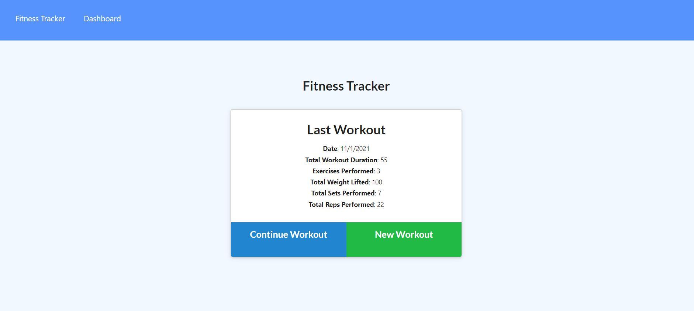

# Workout Tracker

## Description

I have created a workout tracker to track daily workouts and exercises. Users are able to log daily exercises as either cardio or resistance exercises. Cardio exercises store name of exercise, duration of exercise and distance completed of exercise. Resistance exercises store name of exercise, duration of exercise, weight lifted, reps completed and sets completed. Additionally, on the dashboard page, there are two graphs. Workout duration in minutes and amount of weight lifted are tracked for the prior 7 days and displayed via graphs. This application was created with a Mongo database, Mongoose schema and Express routes.

## Installation

To install please run the following commands:

        npm i

To install and seed the database, please run the following command:

        node seeds/seed.js

To start the server, please run the following command:

        node server.js

## Usage 

Link to deployed application: https://tranquil-depths-72212.herokuapp.com/

Photographs of application: 

## Contact 

Please find me on GitHub [nicolepingar](https://github.com/nicolepingar) or email me at nicolepingar@gmail.com.